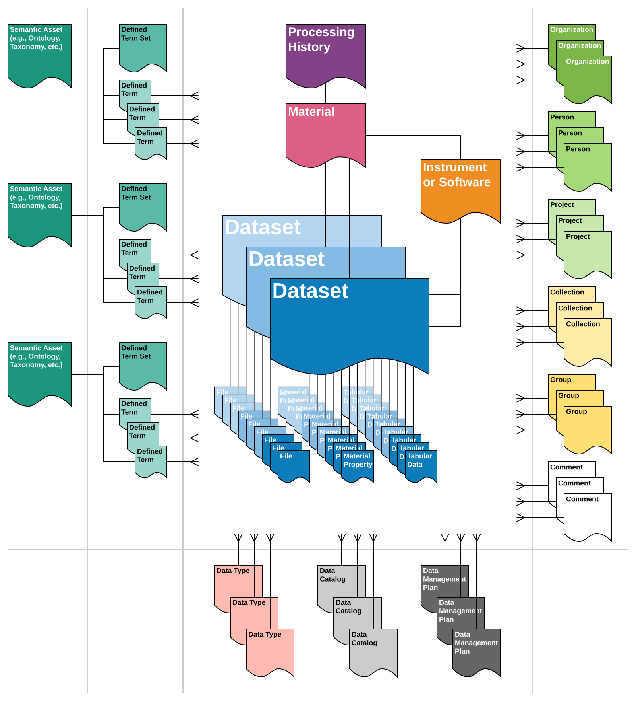

# Preface

The summary below has been created for the specific purpose requesting feedback. Please provide feedback via GitHub issue or by contacting sing [zachary.trautt@nist.gov](mailto:zachary.trautt@nist.gov?subject=mgi-json-schema).

# Background

The [Materials Genome Initiative](https://mgi.gov/) (MGI) is a multi-agency initiative designed to create a new era of policy, resources, and infrastructure that support U.S. institutions in the effort to discover, manufacture, and deploy advanced materials twice as fast, at a fraction of the cost. The missions of the MGI and National Institute of Standards and Technology (NIST) are tightly aligned. NIST has assumed a leadership role within the MGI, where one focus is the establishment of essential materials data and model exchange protocols. Read more about the [MGI at NIST](https://www.nist.gov/mgi).

Initial efforts around materials data exchange protocols resulted in coupled concerns, specifically:

- Coupling of syntactic interoperability and semantic interoperability (as defined in [doi: 10.1177/875647930600300104](https://doi.org/10.1177/875647930600300104))
- Coupling of human presentation/interaction layer to the data management and access layer within prototype web applications.

We have observed that these couplings have limited the pace and comprehensiveness of development of materials data infrastructure.

## Separation of Concerns

### Comparison of Coupled and Decoupled Syntactic and Semantic Interoperability

A simple example of **coupled** syntactic and semantic interoperability is shown below:
```
{
    "youngsModulus": {
        "value": 179,
        "unit": "GPa"
    },
    "ultimateTensileStrength": {
        "value": 855,
        "unit": "MPa"
    },
    "yieldStrength": {
        "value": 494,
        "unit": "MPa"
    }
}
```
In this example, a semantic concept is explicitly invoked in the underlying data model where `"youngsModulus"` is an expected key name. This tactic, while valid, results in client applications that must have domain-specific understanding of the underlying data model, which drastically increases the overall development burden.

A simple example of **decoupled** syntactic and semantic interoperability is shown below:

```
{
    "quantity": [
        {
            "name": "Young's Modulus",
            "identifier": "doi:abc/123",
            "value": 179,
            "unit": "GPa"
        },
        {
            "name": "Ultimate Tensile Strength",
            "identifier": "doi:abc/234",
            "value": 855,
            "unit": "MPa"
        },
        {
            "name": "Yield Strength",
            "identifier": "doi:abc/345",
            "value": 494,
            "unit": "MPa"
        }
    ]
}
```

In this example, the underlying data model is completely agnostic to the existence of the domain-specific concept of `"Young's Modulus"`. The underlying data model would specify a syntactic representation for the domain agnostic concept of a `"quantity"`. This tactic allows for domain agnostic client applications and reduces the overall development burden. The named concept of `"Young's Modulus"` can also have an associated identifier, which could enable direct linkage to semantic assets such as ontologies, taxonomies, etc. Such concepts can be defined using technologies such as [https://www.w3.org/OWL/](https://www.w3.org/OWL/).

### Comparison of Coupled and Decoupled Model Web Applications

In Figure 1, we show: (a) a model web application architecture where the human interface layer is coupled to the model (i.e., logic) layer and the data access layer, and (b) a model web application architecture where the human interface layer is decoupled from the service layer. In the decoupled case, the human interface layer accesses the service layer via an application programming interface (API). While decoupled web application architecture introduces new constraints, it also provides many benefits. These benefits are well-described in online resources (including but limited to):

- [Oracle: Learn About the Microservices Architecture](https://docs.oracle.com/en/solutions/learn-architect-microservice/index.html)
- [Martin Fowler: Microservices](https://martinfowler.com/articles/microservices.html)
- [Red Hat: What are microservices?](https://www.redhat.com/en/topics/microservices/what-are-microservices)

The use of decoupled web application architectures has experienced growing adoption within the private sector and has resulted in the widespread development of "headless" content management systems (including but limited to):
- [Contentful](https://www.contentful.com/)
- [Contentstack](https://www.contentstack.com/)
- [Cloud CMS](https://www.cloudcms.com/)

Within materials science and engineering, a common way to divide the problem space is data producers vs. data consumers. When applied to web applications, data producers and data consumers have different requirements. We have observed that these differences are the largest at the human interface layer and smaller at the other layers. For this use case, in the coupled paradigm (Figure 1.a), a data producer would be required to replicate their data in the system designed for data consumers. This places undue burden on the data producer as they are now required to maintain multiple copies of the data on multiple systems. For this use case in the decoupled paradigm (Figure 1.b), views optimized for different classes of data producers and data consumers can be rapidly developed. For example, a data producer may want to leverage a resource registered in a resource registry, thus a data producer may benefit from a view of resource registry records that is integrated with the data management interface. Likewise, a data producer would benefit from an integrated view of published and unpublished data and would further benefit from a programmatic ability to publish data.


**Figure 1:** A simplified comparison of (a) coupled and (b) decoupled web application architectures.

Two documents, which were published about a decade apart, have made similar statements regarding the state of interoperability in materials science and engineering:

**[2008] Integrated Computational Materials Engineering - A Transformational Discipline for Improved Competitiveness and National Security**
[https://nap.edu/12199](https://nap.edu/12199)
> *Currently the schemas for describing the breadth of database types are at varying degrees of maturity.*

**[2018] Vision 2040: A Roadmap for Integrated, Multiscale Modeling and Simulation of Materials and Systems**
[https://ntrs.nasa.gov/search.jsp?R=20180002010](https://ntrs.nasa.gov/search.jsp?R=20180002010)
> *Critical Gap: No widely accepted community standards or schema for
materials information storage and communication methods*

This highlights the need for renewed focus and perhaps a different approach in the development of essential materials data exchange protocols.

# Introduction

# Methods

## Simplified Object Relational Model


**Figure 2:** A simplified Object Relational Model.

# NIST Disclaimer Statement
**Any mention of commercial products is for information only; it does not imply recommendation or endorsement by NIST.**
